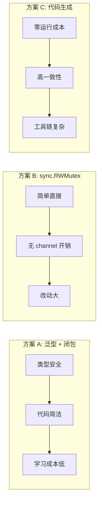
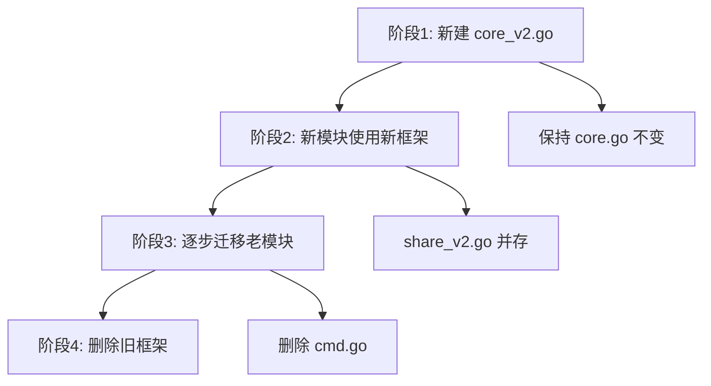

# Actor 并发模型优化设计文档

## 1. 当前架构分析

### 1.1 现有结构

```
pkgs/core/core.go          - 基础 Actor 框架
pkgs/share/actor.go        - ShareActor 定义 + 业务逻辑
pkgs/share/cmd.go          - 命令定义 (每个操作一个 struct)
pkgs/share/share.go        - 对外接口 (包装命令调用)
```

### 1.2 当前调用流程

```mermaid
sequenceDiagram
    participant Caller as 调用方
    participant Interface as share.go
    participant Cmd as cmd.go
    participant Actor as actor.go
    
    Caller->>Interface: GetSharedBlog(title)
    Interface->>Interface: 创建 GetSharedBlogCmd<br/>包含 chan interface{}
    Interface->>Actor: Send(cmd) 到 mailbox
    Actor->>Cmd: cmd.Do(actor)
    Cmd->>Actor: 调用 getSharedBlog()
    Cmd->>Interface: cmd.Response() <- result
    Interface->>Interface: 类型断言 result.(*SharedBlog)
    Interface->>Caller: 返回结果
```

### 1.3 问题清单

| 问题 | 描述 | 影响 |
|------|------|------|
| **抽象层过多** | 每个功能需要修改 3 个文件 | 开发效率低，维护成本高 |
| **模板代码冗余** | 每次调用需要 15-20 行代码 | 代码膨胀，易出错 |
| **类型不安全** | 使用 `interface{}` + 类型断言 | 运行时错误风险 |
| **响应处理复杂** | 多返回值需要多次读 channel | 代码晦涩难懂 |
| **缺少超时机制** | 阻塞等待可能导致死锁 | 系统稳定性风险 |

---

## 2. 问题详细分析

### 2.1 代码冗余示例

**当前实现 (share.go)：添加一个简单的获取操作需要：**

```go
// 第一步：cmd.go 定义命令结构
type GetSharedBlogCmd struct {
    core.ActorCommand    // 嵌入基础命令
    Title string         // 参数
}

func (cmd *GetSharedBlogCmd) Do(actor core.ActorInterface) {
    shareActor := actor.(*ShareActor)           // 类型断言
    blog := shareActor.getSharedBlog(cmd.Title) // 调用业务逻辑
    cmd.Response() <- blog                       // 发送响应
}

// 第二步：actor.go 实现业务逻辑
func (s *ShareActor) getSharedBlog(title string) *SharedBlog {
    b, ok := s.sharedBlogs[title]
    if !ok {
        return nil
    }
    return b
}

// 第三步：share.go 封装接口
func GetSharedBlog(title string) *SharedBlog {
    cmd := &GetSharedBlogCmd{
        ActorCommand: core.ActorCommand{
            Res: make(chan interface{}),  // 每次都创建 channel
        },
        Title: title,
    }
    share_module.Send(cmd)
    result := <-cmd.Response()
    if result == nil {
        return nil
    }
    return result.(*SharedBlog)  // 类型断言，可能 panic
}
```

**问题总结：** 一个 3 行的 map 查询，需要 30+ 行代码分布在 3 个文件中。

### 2.2 多返回值问题

```go
// 当前：需要多次读取 channel
func AddSharedBlog(title string) (string, string) {
    cmd := &AddSharedBlogCmd{...}
    share_module.Send(cmd)
    url := <-cmd.Response()   // 读取第一个值
    pwd := <-cmd.Response()   // 读取第二个值 - 顺序必须正确！
    return url.(string), pwd.(string)
}

// cmd.go 中也需要保持相同顺序
func (cmd *AddSharedBlogCmd) Do(actor core.ActorInterface) {
    url, pwd := shareActor.addSharedBlog(cmd.Title)
    cmd.Response() <- url  // 必须先发 url
    cmd.Response() <- pwd  // 再发 pwd
}
```

**问题：** 发送/接收顺序必须完全匹配，编译器无法帮助检查。

---

## 3. 优化方案

### 3.1 方案对比



| 方案 | 优点 | 缺点 | 推荐场景 |
|------|------|------|----------|
| **A: 泛型闭包** | 类型安全、代码简洁、易迁移 | Go 1.18+ 依赖 | ⭐ 推荐 |
| **B: RWMutex** | 性能最优、简单直接 | 失去 Actor 隔离性 | 高性能场景 |
| **C: 代码生成** | 零模板代码 | 工具链复杂 | 大型项目 |
| **D: 消息反射** | 无需定义类型 | 运行时开销 | 原型开发 |

### 3.2 推荐方案：泛型 + 闭包重构

#### 新核心框架设计

```go
package core

import (
    "context"
    "sync"
    "time"
)

// ========== 新版 Actor 框架 ==========

// Actor 基础结构 - 简化版
type Actor struct {
    mailbox chan func()      // 直接执行闭包，无需命令结构
    ctx     context.Context
    cancel  context.CancelFunc
    wg      sync.WaitGroup
}

// NewActor 创建并启动 Actor
func NewActor() *Actor {
    ctx, cancel := context.WithCancel(context.Background())
    a := &Actor{
        mailbox: make(chan func(), 100),
        ctx:     ctx,
        cancel:  cancel,
    }
    a.start()
    return a
}

func (a *Actor) start() {
    a.wg.Add(1)
    go func() {
        defer a.wg.Done()
        for {
            select {
            case fn := <-a.mailbox:
                fn()  // 直接执行闭包
            case <-a.ctx.Done():
                return
            }
        }
    }()
}

// ========== 泛型执行函数 ==========

// Execute 同步执行，带类型安全
func Execute[T any](a *Actor, fn func() T) T {
    result := make(chan T, 1)
    a.mailbox <- func() {
        result <- fn()
    }
    return <-result
}

// ExecuteWithTimeout 带超时的同步执行
func ExecuteWithTimeout[T any](a *Actor, timeout time.Duration, fn func() T) (T, bool) {
    result := make(chan T, 1)
    a.mailbox <- func() {
        result <- fn()
    }
    
    select {
    case r := <-result:
        return r, true
    case <-time.After(timeout):
        var zero T
        return zero, false
    }
}

// ExecuteAsync 异步执行，返回 channel
func ExecuteAsync[T any](a *Actor, fn func() T) <-chan T {
    result := make(chan T, 1)
    a.mailbox <- func() {
        result <- fn()
    }
    return result
}

// Fire 不关心返回值的执行（fire-and-forget）
func Fire(a *Actor, fn func()) {
    a.mailbox <- fn
}

// ========== 多返回值支持 ==========

// Result2 两个返回值的包装
type Result2[T1, T2 any] struct {
    V1 T1
    V2 T2
}

// Execute2 执行返回两个值的函数
func Execute2[T1, T2 any](a *Actor, fn func() (T1, T2)) (T1, T2) {
    result := make(chan Result2[T1, T2], 1)
    a.mailbox <- func() {
        v1, v2 := fn()
        result <- Result2[T1, T2]{v1, v2}
    }
    r := <-result
    return r.V1, r.V2
}

// Result3 三个返回值的包装
type Result3[T1, T2, T3 any] struct {
    V1 T1
    V2 T2
    V3 T3
}

func Execute3[T1, T2, T3 any](a *Actor, fn func() (T1, T2, T3)) (T1, T2, T3) {
    result := make(chan Result3[T1, T2, T3], 1)
    a.mailbox <- func() {
        v1, v2, v3 := fn()
        result <- Result3[T1, T2, T3]{v1, v2, v3}
    }
    r := <-result
    return r.V1, r.V2, r.V3
}

func (a *Actor) Stop() {
    a.cancel()
    a.wg.Wait()
    close(a.mailbox)
}
```

#### 重构后的 Share 模块

```go
package share

import (
    "core"
    "fmt"
    "github.com/google/uuid"
)

// ========== Actor 定义 ==========

type ShareActor struct {
    *core.Actor                         // 嵌入新版 Actor
    sharedBlogs map[string]*SharedBlog
    sharedTags  map[string]*SharedTag
}

var share_module *ShareActor

func Init() {
    share_module = &ShareActor{
        Actor:       core.NewActor(),
        sharedBlogs: make(map[string]*SharedBlog),
        sharedTags:  make(map[string]*SharedTag),
    }
}

// ========== 新版对外接口 ==========

// GetSharedBlog - 只需 3 行！
func GetSharedBlog(title string) *SharedBlog {
    return core.Execute(share_module.Actor, func() *SharedBlog {
        return share_module.sharedBlogs[title]
    })
}

// GetSharedTag
func GetSharedTag(tag string) *SharedTag {
    return core.Execute(share_module.Actor, func() *SharedTag {
        return share_module.sharedTags[tag]
    })
}

// AddSharedBlog - 多返回值，使用 Execute2
func AddSharedBlog(title string) (url, pwd string) {
    return core.Execute2(share_module.Actor, func() (string, string) {
        if b, ok := share_module.sharedBlogs[title]; ok {
            b.Count++
            return b.URL, b.Pwd
        }
        
        pwd := uuid.New().String()
        url := fmt.Sprintf("/getshare?t=0&name=%s&pwd=%s", title, pwd)
        share_module.sharedBlogs[title] = &SharedBlog{
            Title:   title,
            Count:   9999,
            Pwd:     pwd,
            URL:     url,
            Timeout: get7DaysTimeOutStamp(),
        }
        return url, pwd
    })
}

// ModifyCntSharedBlog
func ModifyCntSharedBlog(title string, c int) int {
    return core.Execute(share_module.Actor, func() int {
        b, ok := share_module.sharedBlogs[title]
        if !ok {
            return -1
        }
        b.Count += c
        if b.Count < 0 {
            delete(share_module.sharedBlogs, title)
            return -2
        }
        return b.Count
    })
}

// GetSharedBlogs - 返回 map
func GetSharedBlogs() map[string]*SharedBlog {
    return core.Execute(share_module.Actor, func() map[string]*SharedBlog {
        return share_module.sharedBlogs
    })
}

// ========== 异步版本示例 ==========

// AddSharedBlogAsync - 非阻塞调用
func AddSharedBlogAsync(title string) <-chan core.Result2[string, string] {
    return core.ExecuteAsync(share_module.Actor, func() core.Result2[string, string] {
        url, pwd := addSharedBlogInternal(title)
        return core.Result2[string, string]{url, pwd}
    })
}

// ========== 带超时版本 ==========

// GetSharedBlogWithTimeout - 1秒超时
func GetSharedBlogWithTimeout(title string) (*SharedBlog, bool) {
    return core.ExecuteWithTimeout(share_module.Actor, time.Second, func() *SharedBlog {
        return share_module.sharedBlogs[title]
    })
}
```

---

## 4. 迁移策略

### 4.1 渐进式迁移步骤



### 4.2 兼容性方案

可以同时保留新旧两套接口：

```go
// share.go - 旧接口 (保持不变，逐步废弃)
func GetSharedBlog(title string) *SharedBlog {
    // 旧实现...
}

// share_v2.go - 新接口
func GetSharedBlogV2(title string) *SharedBlog {
    return core.Execute(share_module.Actor, func() *SharedBlog {
        return share_module.sharedBlogs[title]
    })
}

// 迁移完成后，将 V2 方法改名为原方法
```

### 4.3 迁移检查清单

- [ ] 更新 `go.mod` 确保 Go 版本 >= 1.18
- [ ] 创建 `pkgs/core/core_v2.go` 新框架
- [ ] 选择一个简单模块（如 sms）作为试点
- [ ] 删除对应的 `cmd.go`
- [ ] 迁移所有接口到新框架
- [ ] 运行测试验证功能
- [ ] 逐步迁移其他模块

---

## 5. 优化效果预估

### 5.1 代码量对比

| 模块 | 旧版文件 | 旧版行数 | 新版文件 | 新版行数 | 减少 |
|------|----------|----------|----------|----------|------|
| share | 3 个 | ~300 | 1 个 | ~80 | **73%** |
| sms | 3 个 | ~150 | 1 个 | ~60 | **60%** |
| blog | 3 个 | ~400 | 1 个 | ~120 | **70%** |

### 5.2 性能对比

| 指标 | 旧版 | 新版 | 变化 |
|------|------|------|------|
| 每次调用分配 | 2-3 次 | 1 次 | ≈ 50% 减少 |
| 类型断言 | 运行时 | 编译时 | 更安全 |
| Channel 操作 | 2-3 次 | 1 次 | 更高效 |

### 5.3 开发体验对比

| 场景 | 旧版操作 | 新版操作 |
|------|----------|----------|
| 新增功能 | 修改 3 个文件 | 添加一个函数 |
| 修改参数 | 改 cmd + 接口 | 改闭包参数 |
| 调试 | 跨文件跳转 | 单一闭包 |
| 重构 | 涉及多处 | 局部修改 |

---

## 6. 风险与注意事项

### 6.1 潜在风险

| 风险 | 描述 | 缓解措施 |
|------|------|----------|
| Go 版本依赖 | 需要 Go 1.18+ | 检查部署环境 |
| 闭包捕获 | 闭包可能捕获外部变量 | 代码审查 |
| 调试困难 | 闭包堆栈可能不清晰 | 良好命名 |
| 性能差异 | 泛型实例化开销 | 基准测试 |

### 6.2 最佳实践

```go
// ✅ 好：参数通过闭包捕获
func GetSharedBlog(title string) *SharedBlog {
    return core.Execute(share_module.Actor, func() *SharedBlog {
        return share_module.sharedBlogs[title]  // title 被安全捕获
    })
}

// ❌ 差：在闭包内修改外部变量
func BadExample() {
    var result *SharedBlog
    core.Fire(share_module.Actor, func() {
        result = share_module.sharedBlogs["x"]  // 竞态条件！
    })
    // result 可能还没被赋值
}

// ✅ 好：使用 Execute 返回值
func GoodExample() *SharedBlog {
    return core.Execute(share_module.Actor, func() *SharedBlog {
        return share_module.sharedBlogs["x"]
    })
}
```

---

## 7. 结论

**推荐采用方案 A（泛型 + 闭包）**，理由：

1. **代码简洁** - 减少 60-70% 的模板代码
2. **类型安全** - 编译期类型检查，消除运行时断言错误
3. **易于迁移** - 可以渐进式迁移，新旧并存
4. **保持隔离** - 仍然保持 Actor 模型的并发隔离特性
5. **现代化** - 利用 Go 泛型，代码更符合现代 Go 风格

---

## 附录：完整迁移示例

<details>
<summary>点击展开：SMS 模块完整迁移</summary>

**迁移前 (3个文件)：**
- `sms/actor.go` - 53 行
- `sms/cmd.go` - 19 行  
- `sms/sms.go` - 45 行
- **总计：117 行**

**迁移后 (1个文件)：**

```go
package sms

import (
    "bytes"
    "core"
    "crypto/rand"
    "encoding/json"
    "fmt"
    "io"
    "math/big"
    "net/http"
    "time"
    
    "config"
    log "mylog"
)

type SmsActor struct {
    *core.Actor
    sendURL string
    name    string
    phone   string
}

var sms_actor *SmsActor

func Init() {
    sms_actor = &SmsActor{
        Actor:   core.NewActor(),
        sendURL: config.GetConfigWithAccount(config.GetAdminAccount(), "sms_send_url"),
        name:    config.GetAdminAccount(),
        phone:   config.GetConfigWithAccount(config.GetAdminAccount(), "sms_phone"),
    }
}

// SendSMS 发送短信验证码
func SendSMS() (string, error) {
    return core.Execute2(sms_actor.Actor, func() (string, error) {
        // 验证配置
        if sms_actor.sendURL == "" {
            return "", fmt.Errorf("sms_send_url is not set")
        }
        if sms_actor.phone == "" {
            return "", fmt.Errorf("sms_phone is not set")
        }
        
        // 生成验证码
        n, err := rand.Int(rand.Reader, big.NewInt(1000000))
        if err != nil {
            return "", fmt.Errorf("生成验证码失败: %v", err)
        }
        code := fmt.Sprintf("%06d", n)
        
        // 发送
        payload, _ := json.Marshal(map[string]interface{}{
            "name":    sms_actor.name,
            "code":    code,
            "targets": sms_actor.phone,
        })
        
        client := &http.Client{Timeout: 10 * time.Second}
        resp, err := client.Post(sms_actor.sendURL, "application/json", bytes.NewBuffer(payload))
        if err != nil {
            return "", err
        }
        defer resp.Body.Close()
        
        body, _ := io.ReadAll(resp.Body)
        var result map[string]interface{}
        json.Unmarshal(body, &result)
        
        if status, _ := result["status"].(string); status != "success" {
            return "", fmt.Errorf("发送失败: %s", status)
        }
        
        log.InfoF(log.ModuleSMS, "SendSMS code=%s phone=%s", code, sms_actor.phone)
        return code, nil
    })
}
```

**总计：~70 行，减少 40%**

</details>
