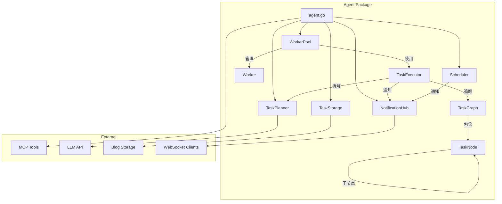
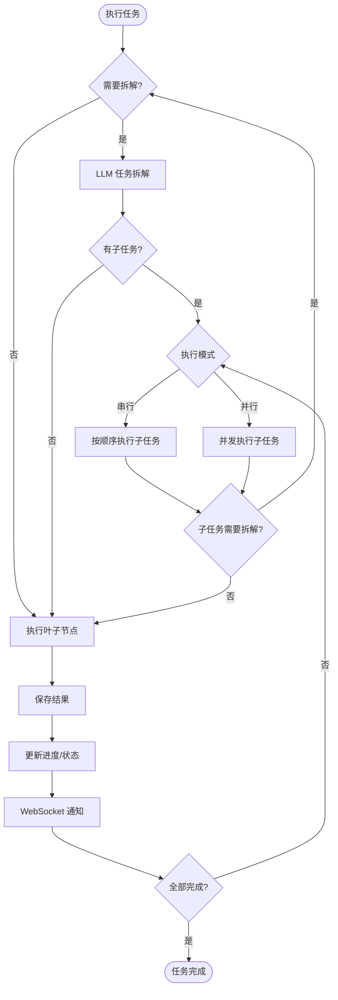

# Agent 包文档

## 概述

`agent` 包是一个基于 Go 语言实现的智能代理任务系统，提供后台任务管理、定时提醒调度和实时通知推送功能。该包集成了 LLM（大语言模型）进行任务规划，并通过 MCP（Meta-Channel Protocol）工具系统实现任务执行。

**v2.0 更新**：支持递归任务拆解、串行/并行执行模式、任务图可视化追踪

## 架构



## 核心组件

### 1. agent.go - 模块入口

**职责**: 模块初始化、全局变量管理、MCP 回调注册

**主要功能**:
- `Init(account string)`: 初始化 Agent 模块
- `Shutdown()`: 关闭模块并释放资源

**旧版任务 API（向后兼容）**:
- `CreateTask()`, `GetTask()`, `GetTasks()`: 任务创建和查询
- `PauseTask()`, `ResumeTask()`, `CancelTask()`, `DeleteTask()`: 任务生命周期管理

**新版 TaskNode API（推荐）**:
- `CreateTaskNode()`: 创建 TaskNode 任务
- `SubmitTaskNode()`: 提交任务（异步执行）
- `ExecuteTaskNodeSync()`: 同步执行任务
- `GetGraphVisualization()`: 获取可视化数据
- `GetGraphJSON()`: 获取 JSON 格式图数据
- `GetDefaultExecutionConfig()`: 获取默认配置
- `NewExecutionConfig()`: 创建自定义配置

---

### 2. task_node.go - 任务节点（新版）

**核心类型**:

#### ExecutionMode - 执行模式
```go
const (
    ModeSequential ExecutionMode = "sequential" // 串行执行
    ModeParallel   ExecutionMode = "parallel"   // 并行执行
)
```

#### NodeStatus - 节点状态
```go
const (
    NodePending   NodeStatus = "pending"   // 等待中
    NodeRunning   NodeStatus = "running"   // 执行中
    NodePaused    NodeStatus = "paused"    // 已暂停
    NodeDone      NodeStatus = "done"      // 已完成
    NodeFailed    NodeStatus = "failed"    // 失败
    NodeCanceled  NodeStatus = "canceled"  // 已取消
    NodeSkipped   NodeStatus = "skipped"   // 已跳过
)
```

#### TaskNode - 任务节点（支持递归子任务）
| 字段 | 类型 | 说明 |
|------|------|------|
| ID | string | 节点唯一标识 |
| ParentID | string | 父节点ID |
| RootID | string | 根任务ID |
| Depth | int | 节点深度（0=根节点） |
| Title | string | 任务标题 |
| Description | string | 任务描述 |
| Goal | string | 期望目标 |
| ExecutionMode | ExecutionMode | 子节点执行模式 |
| ToolCalls | []string | 需要调用的工具 |
| CanDecompose | bool | 是否可进一步拆解 |
| DependsOn | []string | 依赖的节点ID |
| Children | []*TaskNode | 子节点列表 |
| Status | NodeStatus | 当前状态 |
| Progress | float64 | 进度 (0-100) |
| Context | *TaskContext | 任务上下文 |
| Result | *TaskResult | 执行结果 |
| Logs | []ExecutionLog | 执行日志 |

#### TaskContext - 任务上下文（含压缩功能）
| 字段 | 类型 | 说明 |
|------|------|------|
| UserInput | string | 原始用户输入 |
| ChatHistory | []ChatMessage | 聊天历史 |
| ParentResults | []ParentResult | 父任务结果摘要 |
| SiblingResults | []SiblingResult | 兄弟任务结果 |
| Variables | map[string]interface{} | 变量存储 |
| MaxContextLen | int | 最大上下文长度 |
| IsCompressed | bool | 是否已压缩 |

**上下文压缩策略**:
- 保留最近 5 条聊天记录
- 截断每条消息到 500 字符
- 压缩父/兄弟任务摘要到 200 字符

#### TaskResult - 任务结果
| 字段 | 类型 | 说明 |
|------|------|------|
| Success | bool | 是否成功 |
| Output | string | 主要输出 |
| Summary | string | 结果摘要（用于上下文传递） |
| Data | map[string]interface{} | 结构化数据 |
| Error | string | 错误信息 |
| ToolResults | []ToolCallResult | 工具调用结果 |

#### ExecutionConfig - 执行配置
| 字段 | 默认值 | 说明 |
|------|--------|------|
| MaxDepth | 3 | 最大递归深度 |
| MaxContextLen | 4000 | 最大上下文长度（字符） |
| MaxRetries | 2 | 最大重试次数 |
| ExecutionTimeout | 5min | 执行超时 |
| EnableLogging | true | 启用详细日志 |

---

### 3. task_graph.go - 任务图管理

**职责**: 管理任务节点的图结构，支持可视化导出

#### TaskGraph
| 字段 | 说明 |
|------|------|
| RootID | 根节点ID |
| Root | 根节点引用 |
| Nodes | 所有节点索引 |
| Edges | 图边（父子/依赖关系） |
| ActiveNodes | 当前执行中的节点 |
| TotalNodes | 总节点数 |
| DoneNodes | 已完成节点数 |
| FailedNodes | 失败节点数 |

**主要方法**:
- `AddNode()`, `GetNode()`, `UpdateNodeStatus()`: 节点操作
- `GetChildren()`, `GetParent()`, `GetSiblings()`: 关系查询
- `CalculateProgress()`: 计算整体进度
- `GetAllLogs()`: 获取所有日志（按时间排序）
- `ToVisualization()`: 导出可视化数据
- `ToJSON()`: 导出 JSON

#### GraphVisualization - 可视化数据
```json
{
  "nodes": [
    {
      "id": "abc123",
      "parent_id": "",
      "title": "主任务",
      "status": "running",
      "progress": 50,
      "depth": 0,
      "execution_mode": "sequential",
      "has_children": true
    }
  ],
  "edges": [
    {"from": "abc123", "to": "def456", "type": "parent_child"}
  ],
  "stats": {
    "total_nodes": 5,
    "done_nodes": 2,
    "failed_nodes": 0,
    "active_nodes": 1,
    "progress": 50,
    "execution_ms": 3000,
    "max_depth": 2
  }
}
```

---

### 4. executor.go - 任务执行器

**职责**: 执行任务图，支持递归拆解、串行/并行执行

**执行流程**:


#### TaskExecutor

**主要方法**:
- `Execute()`: 执行任务图入口
- `executeNode()`: 执行单个节点
- `shouldDecompose()`: 判断是否需要拆解
- `decomposeNode()`: LLM 任务拆解
- `executeSequential()`: 串行执行子节点
- `executeParallel()`: 并行执行子节点
- `executeLeafNode()`: 执行叶子节点
- `buildNodeContext()`: 构建 LLM 上下文
- `Cancel()`: 取消执行

---

### 5. planner.go - 任务规划器

**职责**: 使用 LLM 将任务分解为可执行子任务

#### NodePlanningResult - 规划结果
```go
type NodePlanningResult struct {
    Title         string            // 任务标题
    Goal          string            // 期望目标
    ExecutionMode ExecutionMode     // 执行模式（LLM 决定）
    SubTasks      []SubTaskPlanNode // 子任务列表
    Reasoning     string            // 拆解思路
}

type SubTaskPlanNode struct {
    Title        string   // 子任务标题
    Description  string   // 详细描述
    Goal         string   // 子任务目标
    Tools        []string // 需要的工具
    CanDecompose bool     // 是否可进一步拆解
    DependsOn    []string // 依赖的子任务
}
```

**主要方法**:
- `PlanNode(node *TaskNode)`: 规划单个节点（新版）
- `ExecuteNode(node *TaskNode)`: 执行单个节点（新版）
- `PlanTask(userInput)`: 规划任务（旧版兼容）
- `ExecuteSubTask(task, subtask)`: 执行子任务（旧版兼容）

---

### 6. worker.go - 工作池

**新增方法**:
- `SubmitTaskNode(node, config)`: 提交 TaskNode 任务（异步）
- `ExecuteTaskNodeSync(node, config)`: 同步执行 TaskNode 任务
- `CreateTaskNode(account, title, description)`: 创建 TaskNode

---

## 使用示例

### 初始化
```go
import "agent"

func main() {
    agent.Init("user123")
    defer agent.Shutdown()
}
```

### 新版 TaskNode API（推荐）

```go
// 创建任务节点
node := agent.CreateTaskNode("user123", "分析博客", "分析本周博客访问量并生成报告")

// 自定义配置（可选）
config := agent.NewExecutionConfig(
    3,    // maxDepth
    4000, // maxContextLen
    2,    // maxRetries
)

// 异步执行
graph := agent.SubmitTaskNode(node, config)

// 或同步执行
graph, err := agent.ExecuteTaskNodeSync(node, nil) // 使用默认配置
if err != nil {
    log.Fatal(err)
}

// 获取可视化数据
vis := agent.GetGraphVisualization(graph)
fmt.Println("Progress:", vis.Stats.Progress)

// 获取 JSON 数据（用于前端展示）
jsonData := agent.GetGraphJSON(graph)
```

### 旧版 API（向后兼容）

```go
// 创建任务
task := agent.CreateTask("user123", "数据分析", "分析昨天的博客访问量", 5)

// 任务控制
agent.PauseTask(taskID)
agent.ResumeTask(taskID)
agent.CancelTask(taskID)
```

---

## WebSocket 通知

### 新版通知类型

| 类型 | 说明 |
|------|------|
| `graph_started` | 任务图开始执行 |
| `graph_update` | 图结构更新（新增子节点等） |
| `graph_completed` | 任务图执行完成 |
| `graph_failed` | 任务图执行失败 |
| `node_started` | 节点开始执行 |
| `node_progress` | 节点进度更新 |
| `node_completed` | 节点完成 |
| `node_failed` | 节点失败 |

### 通知数据结构

```json
{
  "task_id": "root_node_id",
  "type": "node_progress",
  "progress": 50,
  "message": "子任务标题",
  "data": {
    "type": "node_progress",
    "node_id": "child_node_id",
    "node": {
      "id": "child_node_id",
      "title": "子任务标题",
      "status": "running",
      "progress": 100
    },
    "stats": {
      "total_nodes": 5,
      "done_nodes": 2,
      "progress": 50
    },
    "log": {
      "time": "2026-01-15T10:00:00Z",
      "level": "info",
      "phase": "executing",
      "message": "执行完成"
    }
  }
}
```

---

## 依赖关系

| 依赖包 | 用途 |
|--------|------|
| `mcp` | MCP 工具注册和调用 |
| `llm` | LLM API 调用 |
| `control` | Blog 系统控制 |
| `module` | 数据结构定义 |
| `mylog` | 日志记录 |
| `github.com/gorilla/websocket` | WebSocket 支持 |
| `github.com/google/uuid` | UUID 生成 |

---

## 配置说明

| 配置项 | 默认值 | 说明 |
|--------|--------|------|
| MaxDepth | 3 | 最大递归拆解深度 |
| MaxContextLen | 4000 | 最大上下文长度（字符） |
| MaxRetries | 2 | 最大重试次数 |
| ExecutionTimeout | 5min | 单节点执行超时 |
| Worker 数量 | 4 | 并发 Worker 数量 |
| 任务队列容量 | 100 | 任务队列大小 |
| 通知队列容量 | 100 | 通知队列大小 |
| 调度器检查间隔 | 1s | 提醒检查间隔 |
